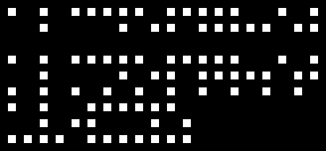

braille-dotgrid
-----

Generates a braille dotgrid image from text.

Wrapping is irrespective of word boundaries and readability concerns like line spacing are sacrificed; this is a stylistic generator for puzzle purposes.




## Setup

```
pip install -r requirements.txt
```

## Examples

- `python braille_img.py --width=6 'Hello world!'`


- Wider padding/margins: 
`python braille_img.py --padding=2 --margin=5 'more spread out grid'`


- File I/O: `python braille_img.py --file=hello.txt --output=hello.bmp`

## Usage
```
Usage: python braille_img.py [options] text

Options:
  -h, --help            show this help message and exit
  -f INPUT, --file=INPUT
                        input file path; takes precedence over `text` arg.
												newlines in files will be respected.
  -o OUTPUT, --output=OUTPUT
                        output file path
  --show                show image (defaults to true if no output file
                        specified)
  --width=WIDTH         grid width in braille characters; default=10
  --margin=MARGIN       margin in dots; default=1
  --padding=PADDING     padding in dots; default=1
  --dotsize=DOT_SIZE    dot size in pixels; default=10
```


## Limitations

Currently supports the following:
```
ABCDEFGHIJKLMNOPQRSTUVWXYZ
abcdefghijklmnopqrstuvwxyz
0123456789
'! ,.;:?
```

Curly and double quotation marks are converted to `'`.
Otherwise, unsupported characters are dropped.

### Todo
+ proper support for curly and double quotation marks
+ parentheses
+ slashes
+ hyphens, dashes
+ international characters


## References

- https://www.pharmabraille.com/pharmaceutical-braille/the-braille-alphabet/
- https://www.brailletranslator.org/
